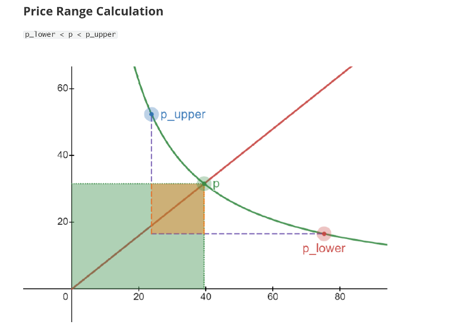

目标：
1. 掌握create pool时设定的价格转化为sqrt_ratio_x64的方法？
2. token price 和 amount关系？
3. 这里设定的 pool price是什么意思？

内容；
1. 价格
参考实验

2. 关系

2.1） 当设置价格为1.0 ，但是amount数量却不同，如果理解这种差异？

现在只是设定价格，添加流动性的时候，会自动考虑价格因素。 
比如你添加amount0 100, 那么自动的amount1也会被添加100？
并不是，这里只添加了amount1 只添加了1.   

Calculated amounts:
- Amount 0: 100
- Amount 1: 1
- Liquidity: 36

代码里返回的是，用户需要支付的基于当时liuqidity等所需要的真实amount1。 

虚拟amount1是否发挥了作用?
tick_current: -69082
sqrt_price_x64_current: 583337266871351552
tick_lower: -71340
tick_upper: -67260
liquidity_delta: 36  [这是added liquidity]

Virtual token quantity是如何起作用的？ 在哪里起作用？
X_virtual = L / √p_upper
Y_virtual = L × √p_lower

Where:
- L = Virtual Liquidity (the abstract liquidity unit)
- p_upper = Upper price boundary
- p_lower = Lower price boundary

In this context, L represents the total virtual liquidity (liquidity gross) at this tick, not the delta L. 【TODO:重要】

问题1： How to Get Total Virtual Liquidity at a Tick？
打印出来
// Each tick has a state that stores the total liquidity
struct TickState {
    liquidity_gross: u128,      // ← This is the TOTAL L at this tick
    liquidity_net: i128,        // Net liquidity change
    // ... other fields
}
举例：
tick_array_pda: DCB4z7hPT4XTdTYdNu1fU7jm26jzhJcEDz3YQ6HXFny

tick[11]: tick=-71340, liquidity_gross=0.000000000000000006830473686658678 (raw: 126), liquidity_net=0.000000000000000006830473686658678 (raw: 126)

Token                                         Balance   
--------------------------------------------------------
So11111111111111111111111111111111111111112   5.00000005
28knhDHrkpc1UpbFfENYKq3JhLg4PyCe1oYdVZXowtRe  100000000 

3. pool price含义？
self.sqrt_price_x64 = sqrt_price_x64;

pub struct PoolState{
    /// The current price of the pool as a sqrt(token_1/token_0) Q64.64 value
    pub sqrt_price_x64: u128,
    ...
}

3.1 pool price在 open position中的应用？
a） liquidity计算 
pool current price 与 p_upper, p_lower不同的位置关系，决定了不同的流动性计算方式

b) amount_0, amount_1计算
计算，当前的流动性，所需的 delta_x, delta_y. 

