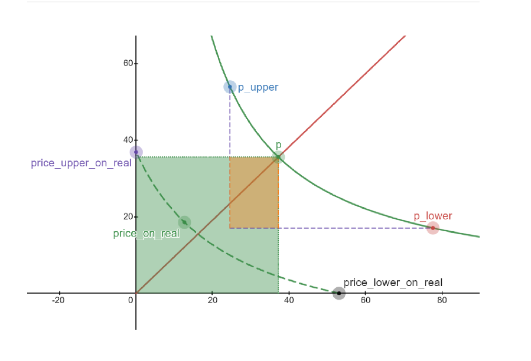

目的：
1. 掌握x_virtual, y_virtual的作用
2. 对比理解实际流动性

内容：
1. 作用
In a concentrated liquidity pool, you want to provide liquidity only within a specific price range [p_lower, p_upper], but the AMM still needs to maintain the constant product invariant x * y = k across the entire price spectrum.

示例： price range内不管price 如何变化，k值(k=x*y)是固定的。
在流动性计算， deltax,deltay的计算过程中，已经默认用 （deltax + x_virtual）*(delta_y + y_virtual) = k，以及L =  sqrt(x*y) 推到出来的公式，进行计算了。 
也就是说，x_virtual,y_virtual已经参与到我们的运算过程了。 

x_virtual = L/sqrt(P_upper) ; y_virtual = L*sqrt(P_lower)
在后续的计算如： 
流动性计算： 
L = delta_x * (sqrt(P_upper) * sqrt(P_lower)/sqrt(P_upper) - sqrt(P_lower))

注意到这里的P_upper, P_lower也参与了运算，也就是说看，x_virtual也参与了运算过程。

2. 实际流动性对比
在实际流动性的计算，以及实际delta_x,delta_y的计算中，
我们先计算了流动性： ΔL = Δx (√P_upper x √P_lower)/(√P_upper - √P_lower)
Δx 是用户输入的数量：10000
./target/release/client open-position 0.9 1.5 --is-base-0 10000
计算出来的 ΔL 就是橙色部分，表示用户实际添加的流动性。  

从图中可以看出来，绿色部分是x_vritual, y_virtual，作用是维持 x*y = K. [长方体的面积size不变]