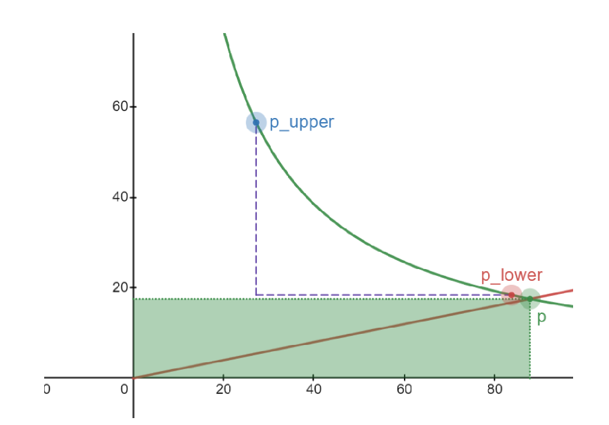

目标：
1. 掌握cross tick时，流动性的变化情况

内容：
1. 跨tick时，流动性的变化情况

Step 1: 获取tick的流动性净变化
let mut liquidity_net = next_initialized_tick.cross(
    if zero_for_one {
        state.fee_growth_global_x64
    } else {
        pool_state.fee_growth_global_0_x64
    },
    if zero_for_one {
        pool_state.fee_growth_global_1_x64
    } else {
        state.fee_growth_global_x64
    },
    &updated_reward_infos,
);

Step 2: 根据swap方向调整流动性
if zero_for_one {
    msg!("liquidity_net before neg: {}", liquidity_net);
    liquidity_net = liquidity_net.neg();  // 取负值
    msg!("liquidity_net after neg: {}", liquidity_net);
}

为什么需要取负值？
    在Uniswap V3/Raydium AMM v3中：
    每个tick存储的是该tick的流动性净变化
    正值表示进入该tick的流动性
    负值表示离开该tick的流动性
swap方向的影响：
    zero_for_one = true（token0 → token1）：
    // 价格下降，需要取负值
    liquidity_net = liquidity_net.neg();
原因：当价格下降时，原来在该价格区间的流动性提供者会退出，所以流动性减少
具体解释，查看https://github.com/raydium-io/raydium-docs/blob/master/dev-resources/raydium-clmm-dev-doc.pdf P<P_lower的图，就可以理解了。  

当发生tick移动时，asset Y的储备数量被全部移出，这个时候，之前tick里的流动性完全由 asset x构成。 这个时候流动性的数量就是x的数量 = x_p_lower - x_p_upper 。 这个时候，基于流动性计算公式 L = sqrt(x*y) = 0,就是说，之前流动性被完全移除，所以这里取负值，然后更新总体流动性。 

同样的，如果我们的tick 从 p_lower对应的tick，又回到 原来的tick， 这个时候价格上升。 这时候我们的流动性又被添加回来了,这个时候当前tick中，x和y的储备又都为正数，就需要流动性为整数，然后更新总体流动性。 
zero_for_one = false（token1 → token0）：
    // 价格上升，不需要取负值
    // liquidity_net保持原值
原因：当价格上升时，新的流动性提供者会进入该价格区间，所以流动性增加

✅ 每个tick存储的是该tick的流动性净变化
✅ 正值表示进入该tick的流动性
✅ 负值表示离开该tick的流动性

2. swap方向的影响
✅ zero_for_one = true（价格下降）需要取负值
✅ zero_for_one = false（价格上升）不需要取负值

zero_for_one = true（价格下降）：
当前价格从高价tick移动到低价tick
低价tick的流动性净变化是正值（表示该tick有流动性）
但需要取负值，因为：
低价tick的流动性是"离开"当前价格区间的
当前价格区间需要减少这部分流动性

zero_for_one = false（价格上升）：
当前价格从低价tick移动到高价tick
高价tick的流动性净变化是正值
不需要取负值，因为：
高价tick的流动性是"进入"当前价格区间的
当前价格区间需要增加这部分流动性

Step 3: 更新全局流动性
state.liquidity = liquidity_math::add_delta(state.liquidity, liquidity_net)?;

流动性变化的时机：
只在跨tick边界时：
    if state.sqrt_price_x64 == step.sqrt_price_next_x64 {
        // 价格正好到达tick边界
        if step.initialized {
            // tick已初始化，执行cross操作
            // 更新流动性
        }
    }

不在tick边界时：
else if state.sqrt_price_x64 != step.sqrt_price_start_x64 {
    // 价格在tick区间内变化，不跨边界
    // 只更新tick，不改变流动性
    state.tick = tick_math::get_tick_at_sqrt_price(state.sqrt_price_x64)?;
}