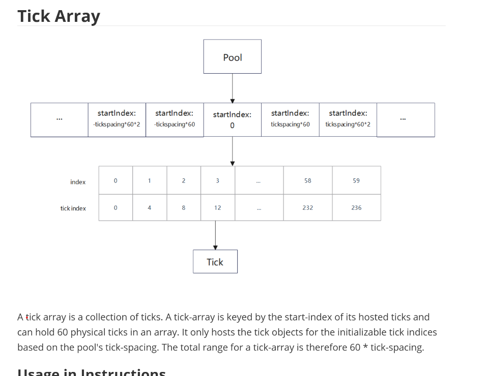

目标：
1. 理解pool -> Tick Arrays -> Ticks之间的关系


内容：
1. 关系
Pool manages multiple Tick Arrays   [TODO: ? ]
Each Tick Array contians individual Tick objects



特征
1) Tick Array Organization by startIndex 
The diagram shows tick arrays are organized contiguously with startIndex values that are multiples of tickspacing * 60:
... → startIndex: -tickspacing*60*2
... → startIndex: -tickspacing*60  
... → startIndex: 0 (central reference)
... → startIndex: tickspacing*60
... → startIndex: tickspacing*60*2
... →


2) Internal Structure: 60 Physical Ticks per Array
The detailed view shows:
Internal indices: 0, 1, 2, 3, ..., 58, 59 (60 total)
Actual tick values: 0, 4, 8, 12, ..., 232, 236
Key insight: Each array holds exactly 60 physical tick objects, not 3600!  【TODO: check 一下】

3） Tick Spacing and Range Calculation
From the pattern 0, 4, 8, 12, ..., 236:
tick_spacing = 4 in this example
Total range per array: 60 * tick_spacing = 60 * 4 = 240 tick units

4）  Mathematical Relationship Confirmed
The formula tick_index = startIndex + (internal_index * tick_spacing) is visually demonstrated:
For index 59: tick_index = 0 + (59 * 4) = 236
For index 0: tick_index = 0 + (0 * 4) = 0


应用
1）Fast lookup
Given any tick index, can quickly find which array contains it
tick index / ticks_in_array

236 / 4*60 = 236/240 = 0 ，在第0个tick_array .


问题：
1. tick units 是什么？ 
Great question! Let me explain the fundamental concepts of tick arrays and tick units in Raydium AMM v3.

## **What are Tick Units?**

### **Tick Units = Price Points**

**Tick units** are **discrete price points** in the AMM system. Think of them as "price steps" or "price levels."

### **Mathematical Relationship:**
```
Price = 1.0001^tick_index
```

Where:
- **`tick_index`** is the tick unit number
- **`1.0001`** is the base multiplier (can vary by pool)
- **`Price`** is the exchange rate between tokens

### **Example with tick_spacing = 60:**
```
Tick 0:    Price = 1.0001^0 = 1.0000 (1:1 ratio)
Tick 60:   Price = 1.0001^60 ≈ 1.0060 (0.6% price change)
Tick 120:  Price = 1.0001^120 ≈ 1.0121 (1.2% price change)
Tick -60:  Price = 1.0001^(-60) ≈ 0.9940 (-0.6% price change)
```

## **What are Tick Arrays?**

### **Tick Arrays = Storage Containers**

**Tick arrays** are **data structures** that group multiple tick units together for efficient storage and access.

### **Structure:**
```rust
pub struct TickArrayState {
    pub pool_id: Pubkey,
    pub start_tick_index: i32,        // First tick in this array
    pub ticks: [TickState; 60],      // 60 tick objects
    pub initialized_tick_count: u8,   // How many ticks have liquidity
    // ... other fields
}
```

### **Key Characteristics:**
- **Fixed size**: Each array holds exactly 60 tick objects
- **Contiguous range**: Covers a specific range of tick units
- **Memory efficient**: Only stores active ticks, not empty ones

## **The Relationship: Tick Arrays vs Tick Units**

### **Visual Representation:**
```
Tick Array #0:  [Tick 0, Tick 4, Tick 8, ..., Tick 236]
Tick Array #1:  [Tick 240, Tick 244, Tick 248, ..., Tick 476]  
Tick Array #2:  [Tick 480, Tick 484, Tick 488, ..., Tick 716]
```

### **Mathematical Relationship:**
```rust
// From the code we saw earlier
start_index = array_number * ticks_in_array
ticks_in_array = 60 * tick_spacing

// So for tick_spacing = 60:
// Array #0 starts at: 0 * (60 * 60) = 0
// Array #1 starts at: 1 * (60 * 60) = 3600  
// Array #2 starts at: 2 * (60 * 60) = 7200
```

## **Why This Design?**

### **1. Memory Efficiency:**
- **Without arrays**: Would need to store every possible tick (millions of them)
- **With arrays**: Only store ticks that actually have liquidity
- **Result**: Massive memory savings

### **2. Fast Lookup:**
- **Given any tick**: Can quickly calculate which array contains it
- **Formula**: `array_number = tick_index / (60 * tick_spacing)`
- **Example**: Tick 5000 → Array #5000/(60*60) = Array #1

### **3. Scalable Coverage:**
- **Each array covers**: `60 * tick_spacing` tick units
- **With tick_spacing = 60**: Each array covers 3,600 tick units
- **Total coverage**: Can handle enormous price ranges

## **Real-World Example**

### **Scenario: SOL/USDC Pool**
```
Current price: $100 (tick 0)
Tick spacing: 60
```

### **Tick Arrays Created:**
```
Array #0:  Ticks [0, 60, 120, 180, ..., 3540]     → Prices $100 to $106
Array #1:  Ticks [3600, 3660, 3720, ..., 7080]    → Prices $106 to $112  
Array #2:  Ticks [7200, 7260, 7320, ..., 10620]   → Prices $112 to $118
```


举例：What Does "240 Tick Units" Mean?  [TODO: 重点]
So 240 tick units , actually means the price range this tick can cover ? 
Yes, 240 Tick Units = Price Range Coverage
What 240 Tick Units Actually Means:
240 tick units means that one tick array can cover a specific range of prices in the AMM system.

240 Tick Units = Price Range Coverage
240 tick units means that one tick array covers a specific range of prices in the AMM system.

Mathematical Breakdown
    From the Example:
    tick_spacing = 4
    ticks_in_array = 60
    Total range per array = 60 × 4 = 240 tick units

What This Means:
    Each tick array covers 240 consecutive tick positions
    But only stores 60 physical tick objects (at positions 0, 4, 8, 12, ..., 236)
    The 240 represents the total span, not the count of stored items

Visual Representation
Tick Array Structure:
Array #0: Covers tick range [0, 1, 2, 3, 4, 5, ..., 239]
         But only stores ticks: [0, 4, 8, 12, 16, ..., 236]
         (60 physical ticks, spaced 4 units apart)
        
Price Impact of 240 Tick Units
Price Calculation:
    Price = 1.0001^tick_index
Example with tick_spacing = 4:
    Tick 0:   Price = 1.0001^0 = 1.0000 (baseline)
    Tick 4:   Price = 1.0001^4 ≈ 1.0004 (+0.04%)
    Tick 8:   Price = 1.0001^8 ≈ 1.0008 (+0.08%)
    ...
    Tick 236: Price = 1.0001^236 ≈ 1.0239 (+2.39%)

So 240 tick units cover:
    From: 1.0000 (baseline price)
    To: 1.0239 (+2.39% price increase)
    Total range: 2.39% price movement


问题：为什么需要这么多的tick array ?
1. Price Range Coverage
The large number of tick arrays is designed to cover enormous price ranges that pools might need:
With tick_spacing = 60 and 14,336 total arrays:
- Each array covers: 60 × 60 = 3,600 tick units
- Total coverage: 14,336 × 3,600 = 51,609,600 tick units
- Price range: From ~0.000001x to 1,000,000x (covers virtually any realistic scenario)


问题:  什么时候一个新的tick array被创建？
new tick arrays are created when an LP adds liquidity in a new price range that exceeds the current tick array coverage.


问题: MIN_TICK 和MAX_TICK是怎么计算的？ 
也就是说price range是有限制的


