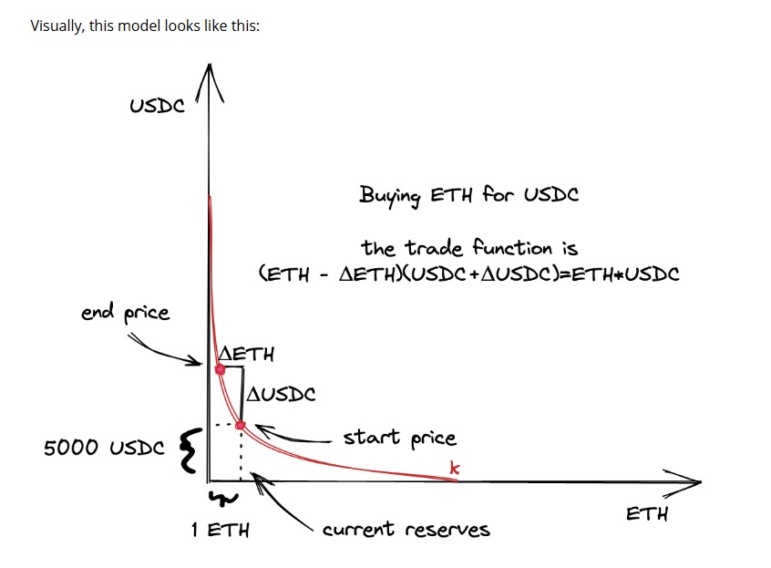

reference:https://uniswapv3book.com/milestone_1/introduction.html

目标：
1. what we will build  ? 

We will build a pool contract that can receive liquidity from users and make swaps within a price range. 
To keep it as simple as possible, we'll provide liquidity only in one price range ans we'll allow to make swaps only in one direction. Also, we'll calculate all the required math manually to get better 
intuition before starting to use mathematical libs in Rust. 

1.1 Let's model the situation we'll build 
a) There wil be an ETH/USDC pool contract. ETH will be the x reserve, and USDC will be the y reserve. 
b) We'll set the current price to 50000 USDC per 1 ETH. 
c) The range we'll provide liquidity into is 4545-5500 USDC per 1 ETH.
d) We'll buy some ETH from the pool. At this point, since we have only one price range, we want the price of the trade to stay within the price range. 

Before getting to the code, Let's figure out the math and calculate al lthe parameters of the model. 