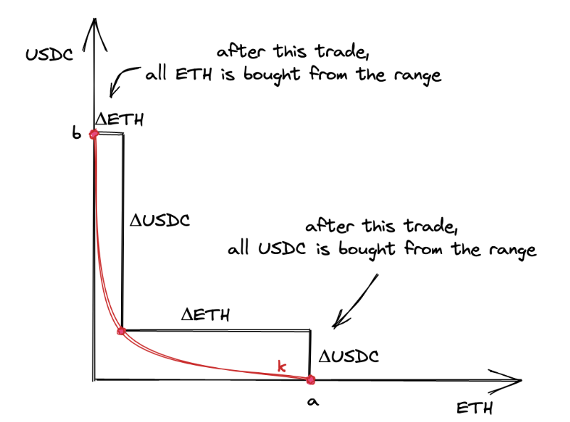
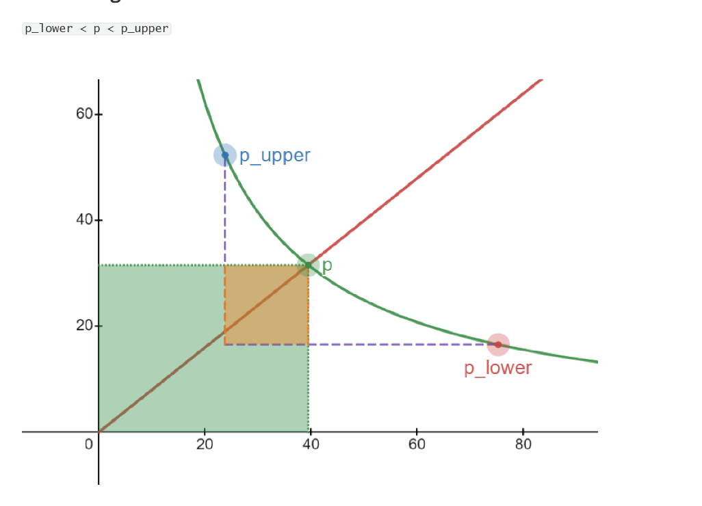

reference:https://uniswapv3book.com/milestone_1/calculating-liquidity.html

Calculating liquidity
Trading is not possible without liquidity, and to make our first swap we need to put some liquidity into the pool contract. Here’s what we need to know to add liquidity to the pool contract:
想要添加流动性，我们要解决的两个问题：
1. A price ragne : 
    As a liquidity provider, we want to provide liquidity at a specific price range, and it’ll only be used in this range.
2. Amount of liquidity:
    which is the amounts of two tokens. We’ll need to transfer these amounts to the pool contract.

在接下来的内容中，我们会先手动计算，然后在合约中再实现。 
Price Range Calculation 
我们要做什么事情？
Recall that, in Uniswap V3, the entire price range is demarcated into ticks: each tick corresponds to a price and has an index. In our first pool implementation, we’re going to buy ETH for USDC at the price of $5000 per 1 ETH. Buying ETH will remove some amount of it from the pool and will push the price slightly above $5000. We want to provide liquidity at a range that includes this price. And we want to be sure that the final price will stay within this range (we’ll do multi-range swaps in a later milestone).

做这件事，需要准备哪些数据？
1. The current tick will correspond to the current price(5000 USDC for 1ETH).
2. The lower and upper bounds of the price ragne we're providing liquidity into.  Let the lower price be $4545 and the upper price be $5500.

From the theoretical introduction, we know that :
sqrt(P) = sqrt(y/x)

Since we've agreed to use ETH as the x reserve and USDC as the y reserve, the prices at each of the ticks are : 
sqrt(P_c) = sqrt(5000/1) = sqrt(5000) ≈70.71
实验：
>>> import math
>>> math.sqrt(5000)
70.71067811865476

sqrt(P_l) = sqrt(4545) ≈67.42
实验：
>>> math.sqrt(4545)
67.4166151627327

sqrt(P_u) = sqrt(5500/1) ≈74.16

where P_c is the current price, P_l is the lower bound of the range, and P_u is the upper bound of the range. 

现在，我们需要获取对应的tick 数据， We know that prices and ticks are connected via this formula:
sqrt(P(i)) = 1.0001^(i/2)
Thus, we can find tick i via :   
i = log_(sqrt(1.0001)(sqrt(P(i))))

Let's find the ticks 
1. current tick: i_c =  log_sqrt(1.0001)70.71 = 85176
实验：
>>> math.sqrt(5500)
74.16198487095663
>>> base = math.sqrt(1.0001)
>>> number = 70.71
>>> log_result = math.log(number) / math.log(base)
>>> print(log_result)
85175.99862852517

2. Lower tick: i_l =  log_sqrt(1.0001)67.42 = 84223

3. Upper tick: i_u = log_sqrt(1.0001)74.16 = 86129

计算所需的数据已经完备了，接下来查看 sqrt(P) 在代码中的表示方式： 
在Raydium CLMM中，使用Q64.64来存储 Sqrt(P). This is a fixed-point number that has 64bits for the integer part and 64bits for the fractional part. 

In our above calculations, prices are floating point numbers: 70.71,67.42,74.16. We need to convert them to Q64.64. Luckily, this is simple: we need to multiply the number by 2^64(Q-number is a binary fixed-point number, so we need to multiply our decimal numbers by the base of Q64.64, which is 2^64). 
We'll get 
sqrt(P_c) = 1.3043817825332783e+21
>>> math.sqrt(5000) * 2**64
1.3043817825332783e+21
sqrt(P_l) = 1.243617046222697e+21
>>> math.sqrt(4545)*2**64
1.243617046222697e+21
sqrt(P_u) = 1.3680471549128566e+21
>>> math.sqrt(5500)*2**64
1.3680471549128566e+21

Tokens Amounts Calculation
The next step is to decide how many tokens we want to deposit into the pool. The answer is as many as we want. The amounts are not strictly defined, we can deposit as much as it is enough to buy a small amount of ETH without making the current price leave the price range we put liquidity into. During development and testing we’ll be able to mint any amount of tokens, so getting the amounts we want is not a problem.

For our first swap, Let's depoist 1 ETH and 5000 USDC. 

注意：
    Recall that the proportion of current pool reserves tells the current spot price. So if we want to put more tokens into the pool and keep the same price, the amounts must be proportional, e.g.: 2 ETH and 10,000 USDC; 10 ETH and 50,000 USDC, etc.

Liquidity Amount Calculation
    Next, we need to calculate L based on the amounts we'll deposit. This is a tricky part, so hold tight!  
    Formula:  L = sqrt(x*y)
该公式的局限性：
    However, this formula is for the infinite curve. But we want to put liquidity into a limited price range, which is just a segment of that infinite curve. We need to calculate L specifically for the price range we’re going to deposit liquidity into. We need some more advanced calculations.

要计算L for a price range: 
 let’s look at one interesting fact we have discussed earlier: price ranges can be depleted. It’s possible to buy the entire amount of one token from a price range and leave the pool with only the other token.

At the points a and b, there’s only one token in the range: ETH at the point a and USDC at the point b.
That being said, we want to find an L that will allow the price to move to either of the points. We want enough liquidity for the price to reach either of the boundaries of a price range. Thus, we want L to be calculated based on the maximum amounts of Δx and Δy.

Now, let’s see what the prices are at the edges. When ETH is bought from a pool, the price is growing; when USDC is bought, the price is falling. Recall that the price is  y/x. So, at point a, the price is the lowest of the range; at point b, the price is the highest.

delatx = x - x_vritual 
delta_y = y - y_virtual

x = L/sqrt(p)
y = L*sqrt(p)

delta_x = L/sqrt(p) - L/sqrt(p_upper)  = L*(sqrt(p_upper) - sqrt(p)) / （sqrt(p) *sqrt(p_upper)）
delta_y = L*sqrt(p) - L*sqrt(p_lower) = L*(sqrt(p) - sqrt(p_lower))

if we also know the price range and given either delta_x and delta_y, we can calcualte the liquidity L. 
L = delta_x*(sqrt(p)*sqrt(p_upper)) / (sqrt(p_upper)-sqrt(p))
L = delta_y/sqrt(sqrt(p)-sqrt(p_lower))

举例：
>>> ETH = 10**9
>>> amount_ETH = 1*ETH
>>> amount_usdc = 5000*ETH
>>> sqrtp_low = math.sqrt(4545)
>>> sqrtp_cur = math.sqrt(5000)
>>> sqrtp_upp = math.sqrt(5500)
>>> liq0 = amount_ETH*sqrtp_cur*sqrtp_upp/(sqrtp_upp-sqrtp_cur)
>>> print(liq0)
1519437308014.7695

Token Amounts Calculation,Again
Since we choose the amounts we’re going to deposit, the amounts can be wrong. We cannot deposit any amounts at any price range; the liquidity amount needs to be distributed evenly along the curve of the price range we’re depositing into. Thus, even though users choose amounts, the contract needs to re-calculate them [TODO: 重要], and actual amounts will be slightly different (at least because of rounding).

公式：
delta_x = L/sqrt(p) - L/sqrt(p_upper)  = L*(sqrt(p_upper) - sqrt(p)) / （sqrt(p) *sqrt(p_upper)）
delta_y = L*sqrt(p) - L*sqrt(p_lower) = L*(sqrt(p) - sqrt(p_lower))

举例：
amount :
>>> liq0 *(sqrtp_upp - sqrtp_cur) / (sqrtp_cur * sqrtp_upp)
1000000000.0

最后，要注意的核心点：
1. new liquidity must not change the current price. 
也就是说，it must be proportional to the current proportion of the reserves. 

